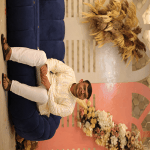

# 🎨 Neural Style Transfer using PyTorch

This project implements **Neural Style Transfer** using a pretrained **VGG19** network in PyTorch.  
It blends the *content* of one image with the *artistic style* of another by optimizing pixel-level representations.

The project is fully **visual**, beginner-friendly, and designed to give instant feedback through intermediate outputs and GIFs.

---

## ✨ Features
- Uses **pretrained VGG19** (no dataset required)
- Optimizes the **image itself**, not the network
- Separate **content loss** and **style loss** using Gram matrices
- Generates a **GIF showing style evolution**
- Runs smoothly on **Google Colab (GPU supported)**

---

## 🧠 Core Idea
Neural Style Transfer works by:
- Preserving **content structure** from a photograph
- Extracting **style statistics** (textures, colors) from an artwork
- Iteratively updating a generated image to minimize:
  
\[
\text{Total Loss} = \alpha \cdot \text{Content Loss} + \beta \cdot \text{Style Loss}
\]

---

## 🖼️ Example Output

| Original | Style | Stylized |
|--------|-------|----------|
| Photo | Artwork | Neural Art |

Additionally, the project generates a **GIF** showing how the image transforms during optimization.

---

## 🚀 How to Run (Google Colab Recommended)

1. Open a new **Google Colab** notebook  
2. Copy the notebook cells from this repository  
3. Upload:
   - `content.jpg` (your photo)
   - `style.jpg` (artwork / painting)
4. Enable GPU:
   - Runtime → Change runtime type → GPU
5. Run all cells

---

## 📦 Dependencies
```bash
torch
torchvision
PIL
matplotlib
